# nikhi1g.github.io

Personal site hosted on GitHub Pages, plus several project pages published under the same domain from their own repos.

## Routes

In this repo:
- `/` — [index.html](index.html), landing page

Published from other repos under the same GitHub Pages domain:
- `/seminal_papers/` — [nikhi1g/seminal_papers](https://github.com/nikhi1g/seminal_papers), a searchable archive of notable papers, essays, memos, and more
- `/mcat/` — [nikhi1g/mcat](https://github.com/nikhi1g/mcat)
- `/153b/` — [nikhi1g/153b](https://github.com/nikhi1g/153b)
- `/ucla-emt-course/` — [nikhi1g/ucla-emt-course](https://github.com/nikhi1g/ucla-emt-course)
- `/SpotifyAdSkipper/` — [nikhi1g/SpotifyAdSkipper](https://github.com/nikhi1g/SpotifyAdSkipper)
